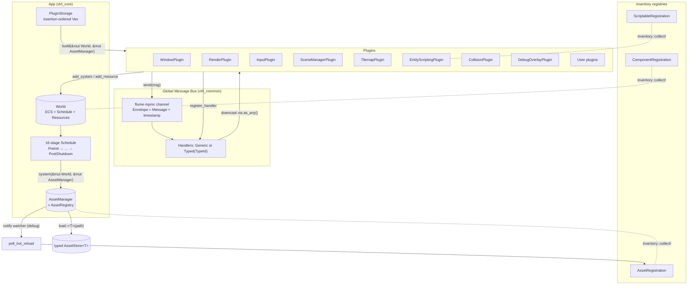

# Vitriol

> ***V**isita **I**nteriora **T**errae **R**ectificando **I**nvenies
> **O**ccultum **L**apidem* — "Visit the interior parts of the Earth; by
> rectification thou shalt find the Hidden Stone." The initials spell
> **VITRIOL**, the engine's name. It's a quiet nod to the engine's lineage:
> an earlier iteration was an alchemy-themed engine called Alkahest, and
> Vitriol is the rewrite that folds in the lessons from that work.

A 2D game engine written in Rust on top of OpenGL 4.5, built as a workspace of
small `vtrl_*` crates that compose through two seams: a `Plugin` trait that
hands a plugin a `&mut World` and `&mut AssetManager` at startup, and a global
message bus that every system can publish to or subscribe to without taking a
direct dependency on the producer.

It currently runs on `glfw` + `gl` (OpenGL 4.5 core) on desktop
Linux/Windows/macOS. OpenGL is the starting point, not the destination — the
renderer is structured to be peeled off into a backend-agnostic layer later.
The engine is single-threaded on the main loop and uses an ECS (`vtrl_ecs`)
with a fixed 16-stage schedule modeled after Bevy.

## Status and audience

This is a personal engine, built for a specific game project and as a vehicle
for learning the low-level / high-performance side of engine work. It is open
source and others are free to use it, but it isn't designed around an external
audience and the API will change without notice when something better
suggests itself.

## Design philosophy

- **Composition over inheritance.** Everything the engine does — windowing,
  rendering, input, scripting, tilemaps, the debug overlay — is a plugin that
  registers systems on a shared `World`. `App::with_default_plugins()` is just
  an ordered list of `insert` calls; users can drop plugins, add their own, or
  reorder by composing `with_plugin` manually.
- **Loose coupling through messages.** Cross-cutting communication (window
  events, shutdown, input state updates) flows through a single global bus.
  Plugins don't hold references to each other; they emit and consume messages.
- **Crate boundaries enforce the architecture.** Each subsystem lives in its
  own crate (`vtrl_window`, `vtrl_render`, `vtrl_scene`, etc.) so it cannot
  reach into another's internals — only into the shared types in `vtrl_common`
  and `vtrl_ecs`.

## Architecture overview



### Lifecycle of a plugin

1. **Registration.** `App::with_plugin(MyPlugin)` pushes the plugin into
   `PluginStorage`, which is a `Vec<(TypeId, Box<dyn Plugin>)>`. Insertion
   order is preserved on purpose: GL-using plugins must `build` after
   `WindowPlugin` so the GL context exists by the time their `Init` systems
   run.
2. **Bootstrap.** `App::run()` calls `PluginStorage::bootstrap`, which invokes
   `Plugin::build(&self, &mut World, &mut AssetManager)` for each plugin in
   order. During `build`, a plugin typically (a) registers ECS systems against
   one or more `ScheduleSlot`s, (b) adds resources to the world, and (c)
   registers message-bus handlers for the message types it cares about. The
   `&self` (rather than `self`) signature is intentional: plugins are
   stateless once built, and any state a plugin needs to carry into its
   systems lives as an ECS `Resource` rather than as plugin fields.
3. **Runtime.** The main loop walks the schedule:
   `PreInit -> Init -> PostInit -> { First, PreUpdate, Update, PostUpdate,
   PreFixedUpdate, FixedUpdate, PostFixedUpdate, PreRender, Render, PostRender,
   Last } -> PreShutdown -> Shutdown -> PostShutdown`. Every system receives
   `(&mut World, &mut AssetManager)`. The final system in `Last` drains the
   message bus by calling `message_bus::process_messages(None)`.

## Event bus design

The bus lives in `vtrl_common::message_bus` as a single
`static MESSAGE_BUS: Lazy<MessageBus>`. It wraps an mpmc channel (`flume`) of
`Envelope { message: Box<dyn Message>, timestamp: Instant }` plus an
`RwLock<Vec<Handler>>` and an atomic message-id counter.

The bus is a direct carry-over from Alkahest, where `flume` was the most
performant mpmc channel available at the time. It predates the plugin
system in this codebase and didn't shape — or get shaped by — the plugin
design; the two are independent abstractions that happen to fit together
cleanly.

### The `Message` trait

```rust
pub trait Message: 'static + Send + Sync + Debug {
    fn message_type_id(&self) -> TypeId { TypeId::of::<Self>() }
    fn message_type_name(&self) -> &'static str { type_name::<Self>() }
    fn priority(&self) -> u32 { 0 }
    fn requires_ack(&self) -> bool { false }
    fn ttl(&self) -> Option<Duration> { None }
    fn category(&self) -> Option<&str> { None }

    fn as_any(&self) -> &dyn Any;
    fn as_any_mut(&mut self) -> &mut dyn Any;
}
```

Defaults cover `priority`, `requires_ack`, `ttl`, `category`, and
`message_type_{id,name}`. The only methods an implementor must write are
`as_any` and `as_any_mut`, which give the bus and handlers a way to upcast a
`&dyn Message` back to a concrete type via `std::any::Any`.

`priority` and `requires_ack` are aspirational — they're on the trait so
that consumers can already annotate their messages, but the current bus
implementation does not sort by priority or track acknowledgements. They
will be wired up if and when a concrete need shows up; until then they're
free metadata.

The trait-based design was chosen so consumers of the engine can define their
own message types in their own crates and publish them on the same bus the
engine uses, without standing up a parallel bus. Any user type that satisfies
`'static + Send + Sync + Debug` and implements `Message` is a first-class
citizen on the bus.

### Subscribing and filtering

`register_handler` takes a `Box<dyn MessageHandler>` and an
`Option<TypeId>`. A handler registered with `None` is a **generic** handler
that sees every message on the bus (used by the debug `MessageSink` and
useful for tracing). A handler registered with `Some(TypeId::of::<T>())` is
**typed** and only fires when the envelope's `message_type_id()` matches.

```rust
message_bus::register_handler(
    Box::new(InputHandler),
    Some(TypeId::of::<WindowMessage>()),
)?;
```

Inside the handler, recover the concrete type with `as_any().downcast_ref`:

```rust
impl MessageHandler for InputHandler {
    fn call(&self, msg: &dyn Message) {
        if let Some(msg) = msg.as_any().downcast_ref::<WindowMessage>() {
            match msg {
                WindowMessage::Key(code, pressed) => { /* ... */ }
                WindowMessage::CursorPosition(x, y) => { /* ... */ }
                _ => {}
            }
        }
    }
}
```

### Delivery semantics

- **Buffered, not immediate.** `send` enqueues an `Envelope` onto the flume
  channel; handlers only run when `process_messages` drains the queue. The
  default `Last`-slot system drains the full queue once per frame.
- **Single end-of-frame drain by design.** Everything sent during frame N
  is processed before frame N+1 begins. Today, messages are exclusively
  used to nudge other systems to update their internal state — there is no
  reactivity (no "this handler returns a new event that triggers another
  handler this frame"). A single drain point keeps that contract clear; if
  reactivity becomes a real requirement, the per-slot drain alternative
  will be revisited.
- **TTL enforcement.** If a message returns `Some(ttl)` and
  `Instant::now() - envelope.timestamp > ttl`, the message is skipped.
  Handlers run in registration order; `priority` is currently ignored.
- **Per-message fan-out.** For each envelope, the bus iterates the handler
  list and dispatches to every generic handler plus every typed handler whose
  `TypeId` matches.

## Plugin system

A plugin is anything that implements:

```rust
pub trait Plugin {
    fn build(&self, world: &mut World, asset_manager: &mut AssetManager);
}
```

`build` is called exactly once, before the schedule starts. Inside `build` a
plugin can:

- Add resources to the world: `world.add_resource(MyResource::default())`.
- Register systems for any `ScheduleSlot`: `world.add_system(slot, |w, mgr| { ... })`.
- Register message-bus handlers: `message_bus::register_handler(handler, Some(TypeId::of::<MyMsg>()))`.
- Pull initial state from `AssetManager` if needed (e.g. preload a default font).

Plugins **do not hold references to each other**. They share state through
three channels only, and the right channel for a given piece of data is
chosen by what kind of data it is:

1. **ECS resources** (`World::add_resource` / `get_resource[_mut]`) for
   **cross-plugin state** — `CommandBuffer`, `Viewport`, `SceneManager`,
   `ScriptEngine`, `AnimationStore`, `TextureAtlas`, `FontAtlas`. Any
   plugin can add or consume resources; there's no ownership convention
   beyond "whichever plugin defines the type usually adds it on `Init`."
2. **ECS components and queries** for **per-entity state** — data attached
   to entities that any plugin can iterate
   (`world.view::<(Quad, Transform), ()>()` etc.).
3. **The message bus** for **events** — "something happened" signals like
   `WindowMessage::Resize` or `SystemMessage::Shutdown` that any number of
   systems may want to observe.

The bundled plugins illustrate the pattern:

| Plugin                  | Owns                                                | Talks to others via               |
| ----------------------- | --------------------------------------------------- | --------------------------------- |
| `WindowPlugin`          | GLFW + GL context, `WindowContext`, `Viewport`      | publishes `WindowMessage`, `SystemMessage::Shutdown` |
| `InputPlugin`           | `GLOBAL_INPUT_STATE` (atomic key/mouse table)       | subscribes to `WindowMessage`     |
| `RenderPlugin`          | `Renderer`, `CommandBuffer`, atlases                | reads ECS components, drains `SceneManager::just_loaded` |
| `SceneManagerPlugin`    | `SceneManager` resource                             | loads via `AssetManager`, exposes `just_loaded` |
| `TilemapPlugin`         | `TileAtlas`, `TilemapRenderer`                      | drains `just_loaded`, pushes commands to `CommandBuffer` |
| `EntityScriptingPlugin` | `ScriptEngine` (Rhai), per-entity `Script` exec     | uses `inventory` registries for component/scriptable types |
| `CollisionPlugin`       | broadphase + narrowphase systems                    | ECS components only               |
| `DebugOverlayPlugin`    | overlay text buffer                                 | reads debug print queue, draws via `CommandBuffer` |

## Resource and asset management

There are two distinct concepts that share the word "resource" in the codebase:

- **ECS resources** (`vtrl_ecs::resource`): typed singletons stored on the
  `World` and accessed by systems via `get_resource` / `get_resource_mut`.
  Used for engine state that needs to be visible across systems and plugins
  (renderer, atlases, viewport, scene manager, script engine, etc.).
- **Assets** (`vtrl_common::asset`): on-disk content loaded by the
  `AssetManager` and addressed by `AssetHandle(Symbol)`, where `Symbol` is a
  `string-interner` handle for the asset's path.

### Asset pipeline

1. **Source abstraction.** `AssetManager` reads through an `AssetSource`
   trait. The default impl is `DirectorySource` rooted at
   `$VTRL_PROJECT_ROOT/` (falling back to `./assets`). A `PackSource` is
   stubbed for release builds but not yet implemented.
2. **Typed stores.** Each asset type `T: Asset` gets its own
   `AssetStore<T>`, keyed by interned path `Symbol`. Stores are kept in a
   `HashMap<TypeId, Box<dyn Any>>` and recovered via downcast — so the public
   `load::<T>` / `get::<T>` API is fully typed even though storage is erased.
3. **Asset trait.** An asset is anything implementing
   `fn load(bytes: Vec<u8>) -> Result<Self>`. Built-in assets:
   `Scene`, `TextureData`, `Font`, `AnimationSet`, `TileSet`, `EntityScript`.
4. **Registration via `inventory`.** The `#[asset]` proc-macro emits an
   `inventory::submit! { AssetRegistration::new::<T>(name) }` block. At
   startup, `AssetRegistry::build` walks the `inventory::iter` to build a
   `HashMap<String, LoaderFn>` so the hot-reload watcher can re-invoke the
   correct loader from a type name string. This means new asset types can be
   added by downstream crates without editing any central match table. The
   same pattern is used for `#[component]` and `#[scriptable]`: the goal is
   to keep the consumer-facing API one annotation wide, with the proc-macro
   handling trait impls, `as_any` / `as_any_mut` boilerplate, and engine
   registration.
5. **Handles are paths.** An `AssetHandle` is just an interned path symbol.
   It serializes back to the original path string (so scene files reference
   assets by path), and deserialization round-trips through the interner.

### Scene-driven loading

The `SceneManager` resource holds three fields: `pending` (a scene file
queued for loading), `current` (the loaded scene), and `just_loaded` — a
`Vec<(String, Symbol)>` of `(asset_type_name, handle)` pairs.

When a scene is requested via `SceneManager::load_scene(path)`, the
SceneManagerPlugin's `First`-slot system:

1. Reads the scene file via `AssetManager::read_bytes` (bypassing the asset
   cache — scenes are one-shot).
2. Parses the RON into `Vec<AssetDef>` + `Vec<EntityDef>`.
3. For each `AssetDef`, calls `ASSET_REGISTRY.load(asset_type, &mut mgr, path)`
   which dispatches into the correct typed `AssetStore`.
4. Pushes each `(asset_type, symbol)` onto `just_loaded`.

Plugins that need to react to newly loaded assets (e.g. `RenderPlugin`
uploading a texture into the `TextureAtlas`, or `TilemapPlugin` registering
a tileset) drain `just_loaded` in their `PreRender` system. Each plugin
`retain`s only the entries it didn't consume, so multiple consumers can
cooperate on the same load list without explicit coordination.

### Hot reload

In debug builds, `AssetManager::init_hot_reload` spins up a `notify`
recursive watcher on the asset root and stashes the receiver. The
`poll_hot_reload` method is wired in as a `PreUpdate` system by `App::bootstrap`
when `debug_assertions` are on. On each tick it drains the `notify` channel,
collects unique modified paths, looks up each path's recorded `TypeId`, and
re-runs the loader through `ASSET_REGISTRY.load`. File-in-transition errors
(editors that write-temp-then-rename) are logged at `debug` and ignored.

The watcher's scope is deliberately limited to the game's asset root.
Engine shaders live inside the engine crates and don't change often;
scripts are game-level assets and are already under the watched root. If a
future workflow needs shader hot-reload during engine development, it will
be added as a separate, opt-in watcher.

### Tradeoffs in the asset design

- **Path-as-key.** Cheap, human-readable handles that survive serialization
  for free. Cost: renaming a file invalidates every handle that referenced
  the old path. There's no content-hashed cache.
- **Type-erased stores via `TypeId`.** Lets new asset types plug in with
  zero central wiring at the cost of a `downcast` on every `get`.
- **Synchronous loading.** Loading is blocking on the main thread. Fine for
  small 2D content; not yet suitable for streaming large worlds.
- **No reference counting.** Once loaded, an asset lives for the lifetime
  of the `AssetManager`. There is no unload/eviction; this keeps the
  ownership model simple but means long-running games leak.
- **Hot reload is best-effort.** It re-runs the loader and replaces the
  cached entry, but consumers that have already copied data out (e.g. the
  `TextureAtlas` after upload) won't see the new version until they re-drain.
- **`just_loaded` is cooperative.** Consumers `retain` only the entries
  they don't claim, and put the rest back. So far no consumer has silently
  failed to drain its entries; if that becomes a real failure mode, an
  explicit subscription model is the natural next step.

## Design decisions and tradeoffs

### Why plugins?

Considered alternatives:

- **A monolithic engine struct** with hard-coded subsystem fields. Simpler,
  but every new subsystem (debug overlay, tilemaps, scripting) requires
  touching the central struct, and there's no clean way for a downstream
  game to swap or omit one.
- **Bevy-style typed plugin DAG with explicit dependencies.** More
  expressive, especially around ordering and conditional builds, but it
  pushes a lot of complexity (system sets, conditions, `App::add_plugins`
  trait magic) onto users who mostly just want to register some systems.

The chosen design — a plain `Vec<(TypeId, Box<dyn Plugin>)>` with one
`build(&mut World, &mut AssetManager)` call — gets ~90% of the value of the
DAG approach with a fraction of the surface area. Insertion order *is* the
ordering contract, and plugins are responsible for putting their work in
the right `ScheduleSlot`. The comment on `PluginStorage::storage` documents
the exact reason a `Vec` was chosen over a `HashMap`: a hash map randomized
GL-context initialization order across runs.

Formalizing this as a `dependencies()` method on `Plugin` is on the
roadmap — the current implicit ordering is fine while the plugin set is
small and stable, and the migration becomes mandatory the moment a frame
scheduler needs the dependency graph (see "What I'd redesign" below).

### Why a global event bus?

Considered alternatives:

- **Direct method calls between subsystems.** Fastest, but creates a tangle
  of crate-level dependencies (e.g. `vtrl_render` needing to know about
  every other plugin that wants to schedule a redraw). It also forecloses
  on user-extensibility: a game crate can't easily inject itself between
  GLFW events and the input plugin.
- **Per-subsystem channels.** Each plugin exposes a typed sender/receiver
  pair. Cleaner static dispatch, but every new producer-consumer pair is a
  new wiring step at app build time, and there's no place for cross-cutting
  observers (e.g. logging every event for replay).
- **A typed broadcast bus per message type.** Type-safe by construction, but
  the number of buses grows with the number of message types, and there's
  no single drain point.

A single global mpmc bus with a trait-object envelope was chosen because:

- It is **publish-anywhere, subscribe-anywhere** without per-pair plumbing.
- It is **extensible from user crates** without any registration step
  beyond `impl Message for MyType`.
- It provides **a single drain point** (`process_messages` in `Last`)
  which makes ordering predictable: every message sent during frame N is
  processed by the end of frame N.

The cost is paid in three places:

- **Implicit ordering.** Because dispatch happens at end-of-frame, a
  message sent in `Update` is not visible to its handlers until then. A
  handler that ends up reading a state mutated by another handler in the
  same drain has an order dependency that's invisible from either site.
- **Debugging.** Following a message from emitter to consumer requires
  grepping for `TypeId::of::<...>()` or `downcast_ref::<...>()` rather
  than following a function call. The debug-only `MessageSink` logs every
  message to mitigate this.
- **Boxing on send.** Every message is boxed into the envelope. For the
  current event volume (window events, shutdown, occasional system
  signals) this is irrelevant; it would matter if the bus were used for
  per-frame per-entity events.

### Resource/asset pipeline tradeoffs

Covered above; the headline tradeoff is that the pipeline optimizes for
**zero central wiring** (via `inventory`) and **scene-driven discovery**
(via `just_loaded`) at the cost of a less rigid model: there's no
compile-time guarantee that a scene's `AssetDef` lists an `asset_type`
that any registered loader understands, and no compile-time guarantee that
every consumer that should drain `just_loaded` does so.

### Performance considerations

- The renderer is **instance-batched**: `Quad`/`Sprite` entities are
  collected into `Vec<QuadInstance>` and submitted as a single
  `DrawQuads` command per pass. Tilemap layers are submitted as bulk
  `TileInstance` arrays.
- A `CommandBuffer` resource decouples *what* to draw from *when* to
  issue GL calls — systems push commands during `Render`, and a single
  `PostRender` system replays them in order. This keeps GL state changes
  centralized and makes it easy for non-rendering plugins (debug overlay,
  collider visualization) to inject draws without touching the renderer.
- The bus's flume channel is unbounded by default. In practice, observed
  queue depth is ~50–100 events per frame, dominated by GLFW input
  events. There's no real risk of unbounded growth at current usage; if
  the bus starts carrying per-entity or per-frame events, switching to
  `bounded` and measuring backpressure becomes worth doing.

Profiling so far has been ad-hoc rather than systematic: the demo's debug
overlay shows live FPS, and at ~100k randomly-updated quads per frame the
engine sustains ~150 FPS on the development machine. A proper pass with
per-`ScheduleSlot` frame-time instrumentation, GPU timer queries on the
renderer, and bus allocation tracking is on the roadmap and not yet done.

### Lessons carried over, and what's still on the redesign list

Vitriol is itself the redesign — it's the second iteration after Alkahest,
written from scratch with the lessons of that work in mind. The biggest
correction was decoupling the renderer from the OpenGL crate: in Alkahest
the two were tightly fused, which meant any new renderer (e.g. tilemaps)
either had to live inside the OpenGL crate or duplicate it. Vitriol
restructures the renderer as its own plugin that other plugins can build
their own renderers alongside, with shared primitives in `vtrl_opengl`.

What's still on the list, even given a clean slate:

- **A declarative plugin dependency graph.** Today, `WindowPlugin` must
  be inserted before GL-using plugins, enforced only by a comment. A
  real `Plugin::dependencies()` would catch this at app build time and
  is a prerequisite for concurrency (below).
- **Concurrency**, which has been actively deferred. Landing it means
  revisiting the singletons (input state, the global message bus),
  adding access-control declarations to every plugin/system so a frame
  scheduler can build the frame graph without deadlocks or aliasing
  violations, and finally formalizing plugin dependencies. None of
  these are interesting in isolation; together they're a serious
  restructure.
- **Async asset loading** with a typed handle that resolves to
  `Pending` until ready. Synchronous loading is fine for the demo,
  but won't scale to streaming worlds.
- **Content-hashed asset keys** instead of path symbols, so renames
  don't invalidate handles and so hot-reload can be guaranteed
  idempotent. Path-rename invalidation hasn't bitten yet, but it's a
  known sharp edge.

## Getting started

Prerequisites: Rust 1.85+ (edition 2024), a working OpenGL 4.5 driver, and
the system dependencies for `glfw` and `freetype` (on Debian/Ubuntu:
`apt install cmake libglfw3-dev`).

```sh
git clone <repo-url> vitriol
cd vitriol
cp .env.sample .env   # sets VTRL_PROJECT_ROOT
cargo run --release
```

All demo assets are committed to the repo, so the clone-and-run path
above produces a visible window with no extra setup. The binary crate at
the workspace root (`vitriol`) boots the engine with
`with_default_plugins()`, loads `scenes/demo.vtrl`, and registers a couple
of Rhai-callable helpers (`animation_name`, `direction_from_velocity`).
The demo scene, animations, and scripts live under `src/scenes`,
`src/animations`, and `src/scripts`.

To build a game on top of the engine, depend on `vtrl_core` and use the
prelude:

```rust
use vtrl_core::prelude::*;

fn main() -> Result<()> {
    App::new()
        .with_default_plugins()
        .with_plugin(MyGamePlugin)
        .with_system(ScheduleSlot::Update, |world, assets| {
            // ...
        })
        .run()
}
```

## Future work

In rough priority order:

1. **Dear ImGui integration** — the foundation for everything editor-shaped.
2. **In-engine tilemap editor**, built on the ImGui layer. Hand-authoring
   tilemaps in RON is painful; this is the most obvious quality-of-life
   win for the game project.
3. **A full scene editor**, growing out of the tilemap editor once the
   ImGui plumbing and asset-binding patterns are settled.
4. **Asset packs** (`PackSource`) for release builds — custom binary
   format with an index/table at the head of the file and per-asset
   `(size, offset)` entries. The trait already exists; the format and
   implementation do not.
5. **Backend-agnostic renderer** — peel the GL specifics out of
   `vtrl_render` so a Vulkan or wgpu backend can slot in behind the
   same `RenderCommand` interface.
6. **Concurrency** — see the redesign section above. This unlocks real
   parallel work but requires the plugin-dependency and access-control
   refactors first.
7. **Async asset loading** with `Pending`-resolving handles.
8. **Content-hashed asset keys** to survive renames and make hot-reload
   idempotent.
9. **Audio plugin.**
10. **Bus subscriptions per `ScheduleSlot`** rather than a single
    end-of-frame drain — deferred until a real reactivity requirement
    forces the issue.
11. **A real profiling pass** — frame-time budget instrumentation per
    `ScheduleSlot`, GPU timer queries on the renderer, allocation
    tracking on the bus.
